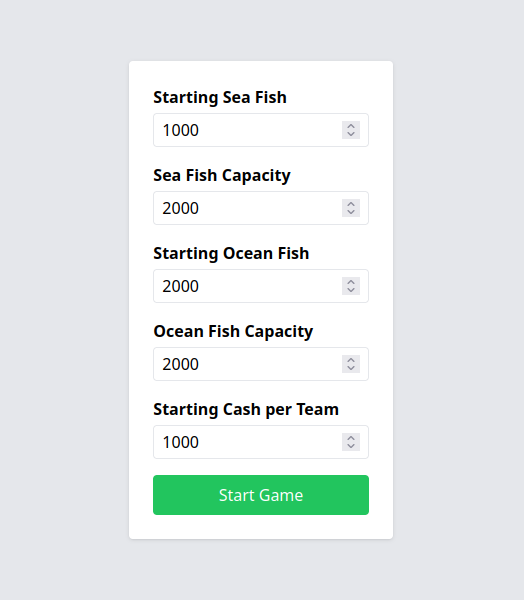
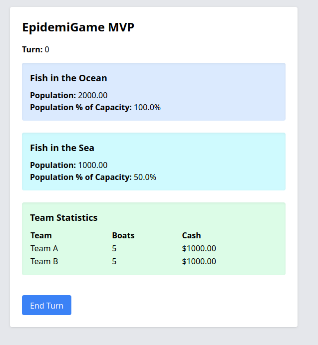
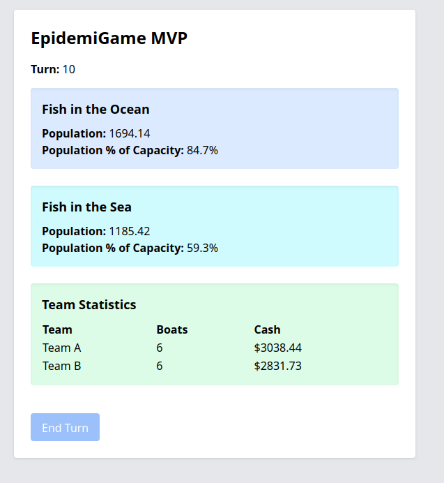

## Przegląd projektu

EpidemiGame MVP to turowa symulacja agentowa inspirowana grą Fishbanks, w której zespoły pozyskują i reinwestują zasoby w kolejnych turach. Backend jest napisany w Pythonie 3.13 z wykorzystaniem Mesy jako rdzenia symulacji, FastAPI do obsługi REST i WebSocketów oraz Uvicorna (z biblioteką websockets) jako ASGI do komunikacji w czasie rzeczywistym. Frontend używa Reacta z Vite dla szybkiego odświeżania i bundlingu, a stylowanie oparto na Tailwind CSS. Użytkownicy mogą uruchomić symulację dla dwóch zespołów i kliknąć **End Turn**, aby przesunąć grę o jedną turę (maksymalnie 10 tur).







## Funkcjonalności

* **Modelowanie agentowe (Mesa):** Zespoły działają jako agenci, łowią zasoby, a populacja regeneruje się zgodnie z modelem logistycznym.
* **REST API i WebSockety (FastAPI):** Rozpoczęcie gry, pobieranie stanu i odbiór aktualizacji w czasie rzeczywistym.
* **ASGI (Uvicorn + websockets):** Obsługa wielu równoczesnych połączeń WebSocket.
* **Nowoczesny frontend (React + Vite + Tailwind):** Błyskawiczne odświeżanie, komponentowy interfejs i utility-first CSS.
* **Limit tur:** Rozgrywka kończy się automatycznie po 10 turach.
* **Architektura modułowa:** Łatwe wymienianie reguł symulacji, silników lub warstw persystencji bez zmiany API czy UI.

## Wymagania wstępne

* Python 3.13 (z menedżerem pakietów pip)
* Node.js 18.x LTS (z npm)
* Opcjonalnie: git do klonowania repozytorium

## Konfiguracja backendu

1. **Klonowanie repozytorium**

   ```bash
   git clone https://github.com/yourusername/EpidemiGame.git
   cd EpidemiGame
   ```
2. **Utworzenie i aktywacja środowiska wirtualnego**

   ```bash
   python3.13 -m venv .venv
   source .venv/bin/activate    # Linux/macOS
   .venv\Scripts\activate     # Windows
   ```
3. **Instalacja zależności Pythona**

   ```bash
   pip install "fastapi[standard]"
   pip install uvicorn[standard]
   pip install mesa
   pip install websockets
   ```
4. **Uruchomienie serwera**

   ```bash
   uvicorn server.main:app --reload
   ```

   Serwer dostępny pod adresem [http://127.0.0.1:8000](http://127.0.0.1:8000)

## Konfiguracja frontendu

1. **Przejście do folderu frontend**

   ```bash
   cd frontend
   ```
2. **Instalacja zależności Node**

   ```bash
   npm install
   ```
3. **Start serwera deweloperskiego Vite**

   ```bash
   npm run dev
   ```

   Aplikacja dostępna pod adresem [http://localhost:5173](http://localhost:5173)

## Użytkowanie

1. **Kliknij** **Start Game**, aby rozpocząć symulację (domyślnie zespoły: Team A i Team B).
2. **Kliknij** **End Turn**, aby wysłać `{ action: 'end_turn' }` przez WebSocket i przesunąć turę o 1.
3. **Obserwuj** numer tury, wielkość populacji i zasoby zespołów aktualizowane w czasie rzeczywistym.
4. **Po 10 turach** przycisk **End Turn** zostanie zablokowany, a gra się zakończy.

## Struktura projektu

```
EpidemiGame/
├── simulation/         # Logika symulacji agentowej (Mesa)
│   ├── agents/         # Definicje agentów
│   ├── engine/         # Wymienne silniki (Mesa, SimPy...)
│   ├── models/         # Modele gry
│   └── rules/          # Parametryzowane reguły gry
├── server/             # Aplikacja FastAPI
│   ├── api.py          # REST endpointy
│   ├── websocket.py    # Endpoint WebSocket
│   ├── game_manager.py # Koordynacja symulacji i klientów
│   └── schemas.py      # Modele Pydantic
├── frontend/           # Interfejs React + Vite + Tailwind
│   ├── index.html      # Shell aplikacji
│   ├── src/            # Komponenty React (App.tsx itd.)
│   └── vite.config.ts  # Konfiguracja Vite
└── README.md           # Ten plik
```

## Współtworzenie projektu

1. Forkuj repozytorium
2. Utwórz gałąź funkcjonalności (`git checkout -b feature/xyz`)
3. Dokonaj zmian (`git commit -m "Dodano xyz"`)
4. Wypchnij i otwórz Pull Request